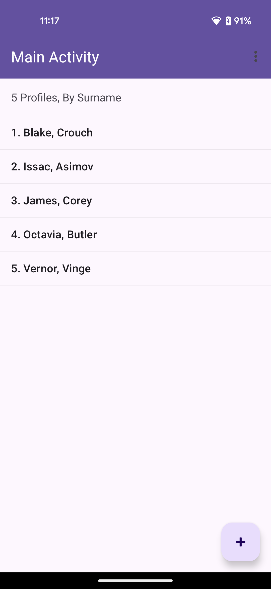
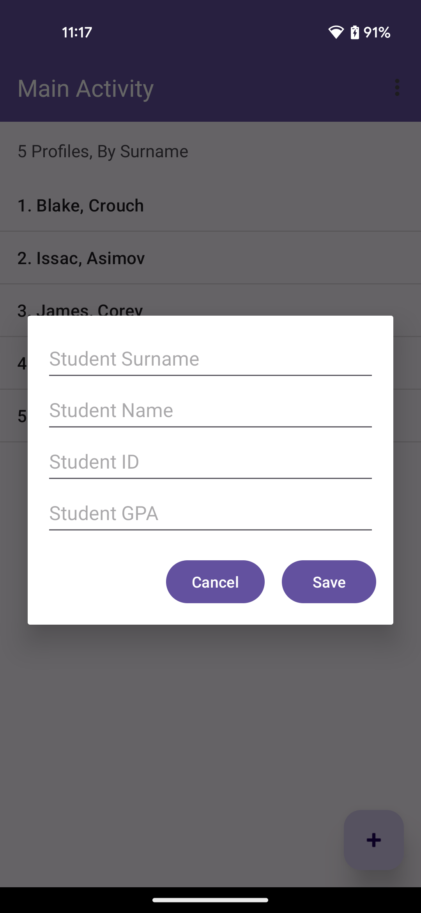
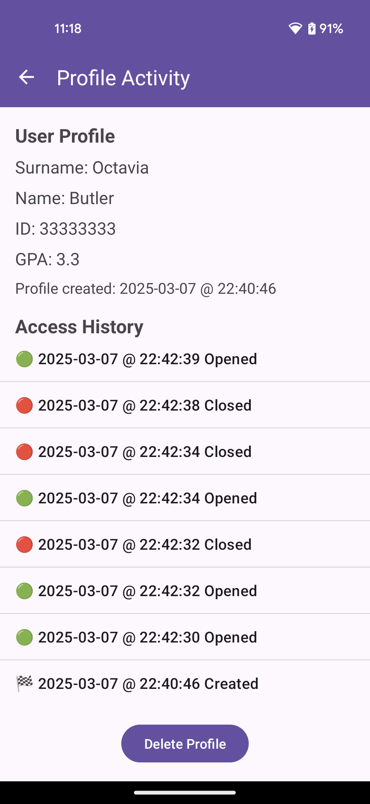

# Student Profile Management App 🚀  

## 📌 Overview  
This is an **Android application** that allows users to create, view, and manage student profiles. Each profile contains a **name, surname, ID, and GPA**, and the app maintains an access history tracking when a profile is **created, opened, closed, or deleted.** The app follows the Model-View-Controller (MVC) architecture and utilizes **SQLite** for persistent storage.

## 🏗️ Features  
✅ **Create Student Profiles** – Add a name, surname, ID (8 digits), and GPA (0-4.3).
✅ **Unique ID Validation** – Ensures that each student ID is unique.
✅ **Profile List View** – Displays all stored profiles in two modes:
- **By Name 📝** – Alphabetically sorted by surname.
- **By ID 📌** – Sorted numerically by ID.
  - ✅ **Toggle Sorting** – Switch between Name and ID sorting using the action bar.
  - ✅ **Profile Details & Access History** – View detailed profile info along with a chronological log of events.
  - ✅ **Track Profile Events** – History logs when a profile is created, opened, closed, or deleted with emoji indicators:
- **🏁 Created, 🟢 Opened, 🔴 Closed, ❌ Deleted.**
  - ✅ **Delete Profiles** – Remove profiles and their **access history** with a single click.
  - ✅ **Floating Action Button** ➕ – Opens a dialog to **add a new profile.**
  - ✅ **Toolbar Navigation** –
     - **MainActivity:** Sorting options in the overflow menu (three dots).
     - **ProfileActivity:** Back button to return to MainActivity.

---

## 🏗️ Architecture (MVC)  
📂 **Model:** `Profile.java`  
Represents a **student profile** with properties like **name, surname, ID, and GPA.**  

📂 **View:** `activity_main.xml`, `activity_profile.xml`, `dialog_insert_profile.xml`  
Defines **UI layout** for profile listing, profile details, and profile creation.  

📂 **Controller:** `MainActivity.java`, `ProfileActivity.java`, `InsertProfileDialogFragment.java`  
Handles **user interactions**, updates the UI, and interacts with the database.  

📂 **Database:** `DatabaseHelper.java`  
Handles **SQLite database operations** for profile management and event logging.

---

## 🎨 UI Screenshots  
| Main Activity | Profile Create Activity | Profile  Activity |
|--------------|----------------|--------------|
|  |  |  |

---

## 📜 Installation & Setup  
1️⃣ **Clone the Repository**  
```bash
git clone https://github.com/yourusername/Student-History-App.git
```

2️⃣ Open in Android Studio
- Open the cloned project in Android Studio
- Sync Gradle and install dependencies

3️⃣ Run the App

Click ▶️ Run to launch the app on an emulator or a real android device.

---

## 🎯 Usage Guide
**📌 Main Screen**
- View all profiles sorted by Name 📝 or ID 📌.
- Click on a profile to open its details.
- Tap the ➕ button to insert a new profile.
- Use the three-dot menu to switch sorting modes.

**📌 Profile Details Screen**
- Displays Name, Surname, ID, GPA.
- Shows Profile Created Timestamp 📅.
- Lists Access History with timestamps & emoji indicators.
- Delete Profile with a single click.

**📌 Insert Profile Dialog**
- Enter Name, Surname, ID, and GPA.
- ID must be 8 digits (10000000 - 99999999).
- GPA must be between 0 and 4.3.
- Save Profile or Cancel.

## 🛠️ Technologies Used
- **Java** – Primary language for Android development.
- **Android SDK** – Core framework for UI and navigation.
- **SQLite** – Local database for storing profiles and access history.
- **Material Components** – UI elements like Floating Action Buttons (FAB).
- **ConstraintLayout** – Responsive UI layout.
